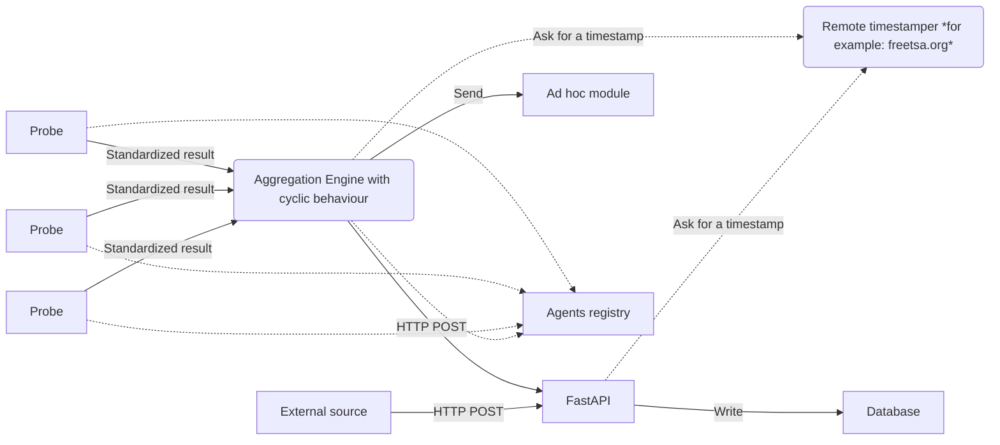

# SCANDALE

## Presentation

[SCANDALE](https://github.com/scandale-project/scandale),
is a libre software which is providing a backend architecture
for collecting data from probes and storing proof of checks.

The platform is composed of:

- a documented HTTP API with a PubSub mechansim and a connection to a
  database;
- a backend to deploy and monitor a network of probes.
  The architecture is relying on the
  [Smart Python Agent Development Environment](https://github.com/javipalanca/spade);
- a service to timestamp the collected data with a third party
  ([RFC 3161](https://www.ietf.org/rfc/rfc3161.txt)) for the proof of checks.

The API is based on the [FastAPI](https://fastapi.tiangolo.com) framework
well known for its excellent performance.

It is possible to extend the platform in order to share data with external
system, such as MISP.

The aim of this rather complex example is to show what is currently possible
to do. You can install an aggregation engine with only one probe
on the same server. But probes can be deployed on a large scale and use a
behavioral mechanism to accomplish their duty.

A probe can reason locally or globally.
The selection of the communication channel between probes is automatic,
based on the probes duties, behaviour and availability. A probe do not
need to know the IP server of an other component of the architecture
(database, aggregation engine, etc.).

Each probe agent is authenticated, registered and declare its availability
(for the presence notification system). The OMEMO protocol can be used for
communications between agents.

## Documentation

A documentation is available [here](https://scandale.readthedocs.io).

## License

`SCANDALE` is distributed under the terms of the
[GNU Affero General Public License version 3](https://www.gnu.org/licenses/agpl-3.0.html).

- Copyright (C) 2022-2023 [Cédric Bonhomme](https://www.cedricbonhomme.org)
- Copyright (C) 2022-2023 [CIRCL - Computer Incident Response Center Luxembourg](https://www.circl.lu)
