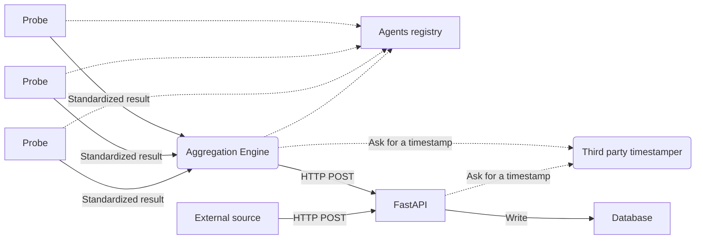

# SCANDALE

## Presentation

[SCANDALE](https://github.com/scandale-project/scandale),
is a libre software which is providing a backend architecture
for collecting data from probes and storing proof of checks.

The platform is composed of:

- a documented HTTP API with a PubSub mechansim and a connection to a
  database;
- a backend to deploy and monitor a network of probes.
  The architecture is relying on the
  [Smart Python Agent Development Environment](https://github.com/javipalanca/spade);
- a service to timestamp the collected data with a third party
  ([RFC 3161](https://www.ietf.org/rfc/rfc3161.txt)) for the proof of checks.

The API is based on the [FastAPI](https://fastapi.tiangolo.com) framework
well known for its excellent performance.

It is possible to extend the platform in order to share data with external
system, such as MISP.

Each probe agent is authenticated, registered and declare its availability
(for the presence notification system). The OMEMO protocol can be used for
communications between agents.

## Documentation

A documentation is available [here](https://scandale.readthedocs.io) with more
information about the architecture and the installation process.

## License

`SCANDALE` is distributed under the terms of the
[GNU Affero General Public License version 3](https://www.gnu.org/licenses/agpl-3.0.html).

- Copyright (C) 2022-2023 [Cédric Bonhomme](https://www.cedricbonhomme.org)
- Copyright (C) 2022-2023 [CIRCL - Computer Incident Response Center Luxembourg](https://www.circl.lu)
