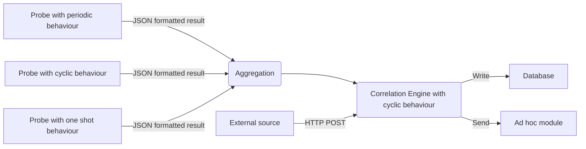

# Pumpkin - The MAS Demonic Surveillance Platform 🎃

-----

**Table of Contents**

- [Conceptual architecture](#conceptual-architecture)
- [Installation](#installation)
- [License](#license)


## Conceptual architecture



You can see some screen shots [here](docs/_static/).

``Ad hoc module``: a module in order to share data with external platforms,
such as MISP or other database systems.

The correlation agent also provides a PubSub mechanism.


## Installation

### Install an XMPP server

To choose an XMPP server, visit this [page](https://xmpp.org/software/servers.html).

To create a new XMPP account you can follow the steps
[here](https://xmpp.org/getting-started/).
Create an XMPP account for each demon.
Each demon will have a different JID and a different password.

### Install the correlation agent


```shell
$ poetry install
```

## License

`pumpkin` is distributed under the terms of the
[GNU Affero General Public License version 3](https://www.gnu.org/licenses/agpl-3.0.html).

Copyright (C) 2022 [Cédric Bonhomme](https://www.cedricbonhomme.org)
