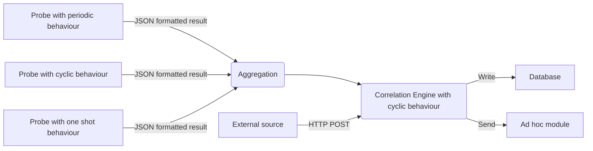

# Pumpkin - The MAS Demonic Surveillance Platform 🎃

-----

**Table of Contents**

- [Conceptual architecture](#conceptual-architecture)
- [Installation](#installation)
- [License](#license)

Pumpkin, the MAS Demonic Surveillance Platform, is a libre software which is providing
a __backend architecture__ for executing tests on an infrastructure, collecting
results and storing proof of checks.
It also provides different mechanisms of extensions and connections.

## Conceptual architecture



The purpose of this rather complex example is to show what it would currently
be possible to do.

Each agent is authenticated, registered and declare its availability
(for the presence notification system). The OMEMO protocol can be used for
communications between agents.


You can see some screen shots [here](docs/_static/).

``Ad hoc module``: a module in order to share data with external platforms,
such as MISP or other database systems.

The correlation agent also provides a PubSub mechanism.
More information in the [documentation](https://pumpkin-project.readthedocs.io).


## Installation

### Install an XMPP server

To choose an XMPP server, visit this [page](https://xmpp.org/software/servers.html).

To create a new XMPP account you can follow the steps
[here](https://xmpp.org/getting-started/).
Create an XMPP account for each demon.
Each demon will have a different JID and a different password.

### Install the correlation agent


```shell
$ poetry install
```


## Documentation

A documentation is available [here](https://pumpkin-project.readthedocs.io).

A list of references articles is provided [here](https://pumpkin-project.readthedocs.io/en/latest/references.html).


## License

`pumpkin` is distributed under the terms of the
[GNU Affero General Public License version 3](https://www.gnu.org/licenses/agpl-3.0.html).

Copyright (C) 2022 [Cédric Bonhomme](https://www.cedricbonhomme.org)
