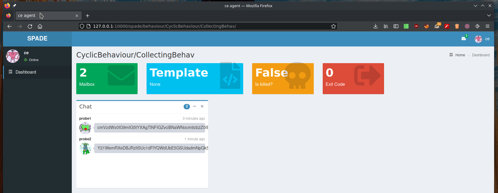
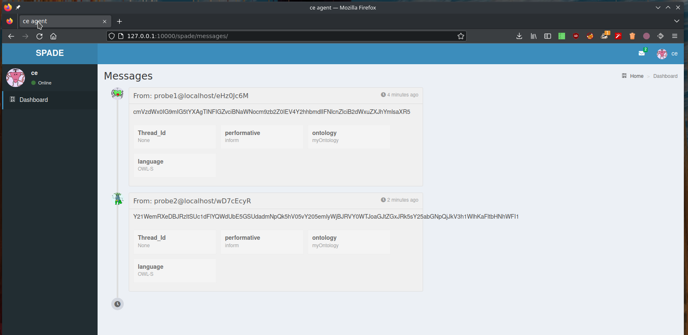
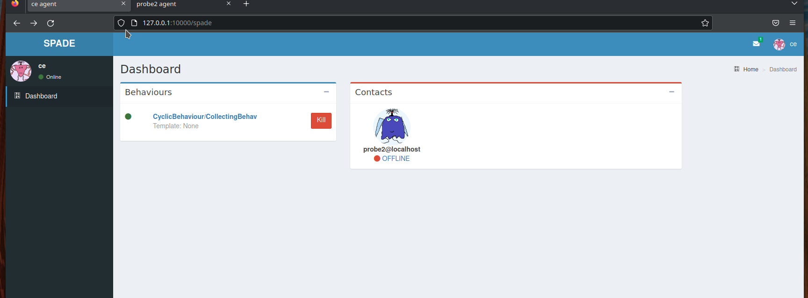

Architecture
============


.. mermaid::

    flowchart LR

    A[Probe with periodic behaviour] -->|JSON formatted result| B(Aggregation)
    AA[Probe with cyclic behaviour] -->|JSON formatted result| B
    AAA[Probe with one shot behaviour] -->|JSON formatted result| B
    B --> C(Correlation Engine with cyclic behaviour)
    C -->|Write| D[Database]
    C -->|Send| E[Ad hoc module]
    F[External source] -->|HTTP POST| C

|

Each agent is authenticated, registered and declare its availability
(for the presence notification system).

``Ad hoc module``: a module in order to share data with external platforms,
such as MISP :footcite:p:`10.1145/2994539.2994542` or other database systems.


The correlation agent also provides a PubSub mechanism.


Type of agents
==============

Each agent has the possibility to provide a HTML view
and different services.


Correlation Engine
------------------

Pub/Sub mechanism
`````````````````


Probe agent
-----------

One shot
````````

A one shot probe agent can be launched for a ponctual task.
For example a task triggered by an action of a user via a
graphical user interface.  
A agent is able to manage a list of jobs. For an important
number of jobs it is possible to launch several agents in parallel.


Periodic
````````

An agent capable of executing a specific task at a scheduled ``period``.


Screen shots
============



   List behaviours of the Correlation Engine




   Messages received by the Correlation Engine from various probes.




   Presence notification


.. figure:: _static/04-contact-details.png
   :alt: Some details about a contact of the Correlation Engine.

   Some details about a contact of the Correlation Engine.


.. footbibliography::
