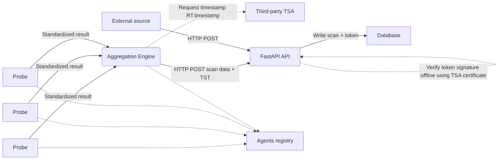
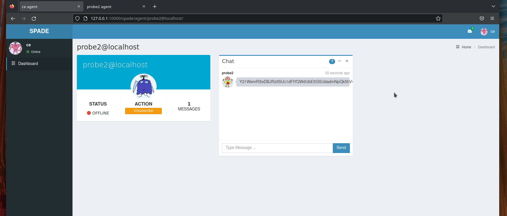
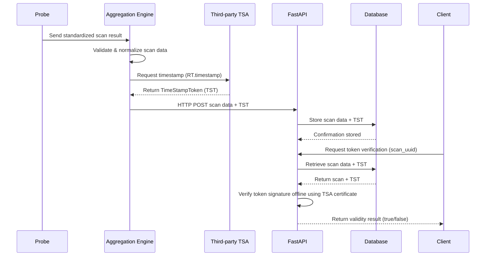

\phantomsection
\addcontentsline{toc}{section}{Abstract}
\section*{Abstract}

Establishing trusted, time-stamped records of system states in distributed environments presents a significant challenge for maintaining accountability and security. Organizations often struggle to produce non-repudiable proof that a specific check was performed or that a system was in a particular state at a precise moment in time. SCANDALE is a libre software solution designed to address this challenge by providing a robust backend architecture for collecting data from distributed probes and storing immutable proofs of those checks. Its core components include a high-performance HTTP API with real-time capabilities, an agent-based backend built on the Smart Python Agent Development Environment (SPADE) for scalable probe management, and a dedicated service for cryptographic timestamping in compliance with RFC 3161. The platform’s primary contribution is its ability to transform operational measurements into **cryptographically verifiable evidence**, yielding a durable and non-repudiable audit trail.


# Introduction: The Imperative for Verifiable System Audits

In modern cybersecurity and IT operations, the ability to produce verifiable data is of strategic importance. Proving that a specific action was taken or that a system was in a particular state at a precise time is critical during incident response, compliance audits, regulatory oversight, or contractual disputes. In the absence of tamper-evident mechanisms, organizations remain vulnerable to contestation and lack the evidentiary guarantees required to enforce accountability.

[SCANDALE](https://github.com/scandale-project/scandale)^[Source code of SCANDALE: https://github.com/scandale-project/scandale] is an open-source platform engineered to address this gap by enabling the creation of verifiable and non-repudiable audit artifacts. It provides a comprehensive architecture for collecting data from a network of distributed probes and cryptographically timestamping the resulting artifacts to produce authoritative “proofs of check.” These proofs make it possible to demonstrate, without reliance on implicit trust, that a given observation existed at a specific point in time. SCANDALE is distributed under the terms of the [GNU Affero General Public License version 3](https://www.gnu.org/licenses/agpl-3.0.html)^[AGPLv3: https://www.gnu.org/licenses/agpl-3.0.html] and is fully operational.

The platform is composed of three primary components:

* A documented HTTP API featuring a publish–subscribe mechanism for real-time data dissemination.
* A backend built on the Smart Python Agent Development Environment (SPADE), responsible for deploying, coordinating, and monitoring distributed probes.
* A cryptographic timestamping service that anchors collected data to an external **Time-Stamping Authority** (TSA) in accordance with RFC 3161 standards [@rfc3161].

This paper presents the design principles, architecture, and validation mechanisms of SCANDALE, with a particular focus on how cryptographic timestamping and offline verification enable trust-minimizing, long-term auditability.


# Related Work

Multi-agent systems (MAS) have long been proposed as a suitable paradigm for distributed monitoring, coordination, and security enforcement. Guemkam et al. [@5931359] describe a trusted MAS architecture for alert detection in financial critical infrastructures, emphasizing agent autonomy, contextual awareness, and authenticated communication channels. Their work demonstrates that MAS-based approaches can improve resilience and trust in highly distributed environments.

Institution-oriented models further formalize agent interactions by introducing explicit roles, norms, and governance structures. Schmitt et al. present UTOPIA [@5536694], an institutional framework that highlights the importance of structured agent organizations and rule-based coordination. These concepts influenced the design of SCANDALE, particularly in the explicit separation of responsibilities between probes, aggregation components, and verification services.

From a middleware perspective, SPADE 3 represents a significant evolution of Python-based MAS platforms. Palanca et al. [@9207929] describe how SPADE 3 improves scalability, lifecycle management, and asynchronous communication through XMPP. SCANDALE directly leverages these capabilities to orchestrate large fleets of probes while preserving secure and reliable message exchange.

While prior work has addressed distributed monitoring and agent-based coordination, SCANDALE distinguishes itself by integrating cryptographic timestamping as a first-class primitive. By anchoring collected observations to RFC 3161-compliant timestamps and enabling offline verification, the platform extends MAS-based monitoring into the domain of non-repudiable, independently verifiable audit evidence.


# System Architecture and Core Components

The SCANDALE architecture is designed for scalability and reliability, orchestrating data collection, aggregation, and verification through a set of specialized, interoperable components. This modular design ensures that each part of the system can perform its function efficiently while contributing to the overall goal of creating a trusted audit log. This section deconstructs the architecture and clarifies the role of each component.

## Architectural Overview and Data Flow



The system supports multiple data ingestion paths, enabling both agent-based and external sources to submit scan results. The core operational flow can be summarized as follows:

1. Data Collection  
   A distributed set of Probe agents performs localized scans. Each probe normalizes the output of its embedded tools into a standardized format before transmitting the results.

2. Aggregation and Timestamping  
   The Aggregation Engine centralizes data received from the probe network. When required, it requests a cryptographic timestamp from a trusted third-party RFC 3161 Time-Stamping Authority (TSA) to produce verifiable proof of data existence at a given time.

3. Ingestion and Storage  
   A FastAPI-based HTTP API acts as the primary data interface. It accepts scan data either from the Aggregation Engine or directly from external sources, verifies the integrity of the submission, and persists both the scan results and their associated proofs in the database.


## Core Components

### Probe Agents

Probe agents are the primary data collectors deployed across the monitored environment. They embed one or more scanning tools and are responsible for transforming heterogeneous tool outputs into a normalized, standardized representation before transmission.

Probes operate in two execution modes:

- **One-shot**: Intended for ad hoc or user-triggered tasks. Large workloads can be parallelized by spawning multiple one-shot agents.
- **Periodic**: Configured to run scheduled tasks at fixed intervals, enabling continuous and automated monitoring.


### Aggregation Engine

The Aggregation Engine serves as the central consolidation point for all probe-generated data. Beyond aggregation, it manages the Time-Stamp Protocol (TSP) workflow defined in RFC 3161. By interacting with a trusted third-party TSA (e.g., [freetsa.org](https://freetsa.org)), it can obtain cryptographic timestamps that provide strong, externally verifiable evidence of data integrity and timing.


### HTTP API

The HTTP API is the main interaction layer of the SCANDALE platform. Built on FastAPI, it is designed for high-throughput ingestion and asynchronous processing, which are essential for real-time features such as Pub/Sub distribution.

Its responsibilities include:

- Receiving scan data from aggregation components or external sources
- Validating structure and integrity using Pydantic models
- Verifying timestamp tokens offline using TSA certificates
- Persisting scans and associated proofs
- Exposing retrieval endpoints for stored data


## SPADE Agent-Based Framework

The backend architecture relies on the Smart Python Agent Development Environment (SPADE) to deploy and manage the probe network. Using a mature agent framework abstracts away agent lifecycle management and communication concerns, allowing SCANDALE to focus on data collection, aggregation, and verification.

Within SPADE, each agent is an authenticated and registered entity that advertises its availability via presence notifications. This model provides a scalable and flexible foundation for orchestrating distributed scanning activities across heterogeneous environments.

The following section details the data formats and verification mechanisms that underpin the system’s core guarantees.





# Implementation Details and Key Mechanisms

The robustness and utility of the SCANDALE platform are rooted in its specific technical implementations. These mechanisms ensure data integrity, facilitate real-time communication, and maintain interoperability through standardized data formats. This section explores these core technical features.

## Data Integrity via RFC 3161 Timestamping

The cornerstone of SCANDALE's integrity model is its use of a third-party, RFC 3161 compliant timestamping service. The critical benefit of this approach is that the resulting proof is verifiable independently of the SCANDALE system itself. By sending a hash of the collected data to a trusted Time-Stamping Authority (TSA), the system receives a signed token that cryptographically binds the data's hash to a specific point in time. This provides non-repudiable proof of the check's existence, as any third party can validate the signed timestamp against the data without needing to trust the SCANDALE database or its operators.

## API Services and Real-time Communication

The platform's API is built on the FastAPI framework, ensuring high performance and adherence to modern web standards. It is fully compliant with the OpenAPI Specification v3.1.0, making it well-documented and easy to integrate with other tools and services.

A key feature of the API is its Pub/Sub (Publish/Subscribe) mechanism, which allows clients to receive real-time notifications about system events. The following Python code snippet demonstrates a simple client that subscribes to the *scan* and *tst* topics to receive event data as it is generated.

```python
import asyncio
import os
import sys
from fastapi_websocket_pubsub import PubSubClient

PORT = int(os.environ.get("PORT") or "8000")

async def on_events(data, topic):
    print(f"running callback for {topic}!")
    print(data)

async def main():
    # Create a client and subscribe to topics 'scan' and 'tst'.
    client = PubSubClient(["scan", "tst"], callback=on_events)
    client.start_client(f"ws://localhost:{PORT}/pubsub")
    await client.wait_until_done()

asyncio.run(main())
```

## Standardized Data Formats

To ensure seamless interoperability between components, SCANDALE employs standardized JSON formats, with validation enforced by [Pydantic](https://pydantic.dev)^[Pydandic: https://pydantic.dev].

The structure for data originating from scans is designed for clarity and completeness. The meta object contains essential context like a UUID, source, and timestamp, while the payload contains the base64-encoded raw output from the scanning tool.

Data from the scans:

```json
{
    "version": "1",
    "format": "scanning",
    "meta": {
        "uuid": "<UUID>",
        "source": "<source>",
        "ts": "date",
        "type": "nmap-scan"
    },
    "payload": {
        "raw": "<base64-encoded-string>"
    }
}
```

The configuration for each probe agent is also defined in JSON format.
This allows administrators to define an agent's behavior, including its execution period, target, and the command it should run.
The *result_parser* field specifies the logic for normalizing scan output, while the *up_agent* field designates the destination for the processed data, typically the Aggregation Engine.

Agent configuration:

```json
{
    "uuid": "",
    "period": 3600,
    "target": "",
    "command": "",
    "args": [],
    "expected_value": "",
    "result_parser": "",
    "up_agent": "",
    "jid": "",
    "passwd": ""
}
```

These technical features provide the foundation for SCANDALE's practical application in real-world scenarios requiring verifiable data.


## Verifiable Data Validation

The ultimate objective of SCANDALE is not merely to collect data, but to enable **independent and cryptographically verifiable validation** of that data.
To this end, the platform provides HTTP API endpoints that allow third parties to:

- Retrieve collected scan artifacts,
- Access the associated TimeStampTokens (TST), and
- Verify the integrity and temporal validity of data without relying on trust in the SCANDALE platform or its operators.

This trust-minimizing approach ensures that SCANDALE acts as a facilitator of evidence rather than a centralized authority.


### Trust Model and Verification Scope

The validation workflow does not require trust in the SCANDALE database or its operators. Any third party with access to:

- the stored scan payload,
- the corresponding TimeStampToken (TST),
- and the TSA’s public certificate,

can independently reproduce the verification process. This property establishes SCANDALE as a trust-minimizing system, where the platform acts as a facilitator of evidence rather than a trusted authority.

As a result, SCANDALE enables verifiable, non-repudiable proof-of-checks that remain valid even if the platform itself is decommissioned.



Figure: Sequence diagram for token validation. The SCANDALE FastAPI server performs the RFC 3161 verification and returns a validity result to the client.

Key points:

- Verification is performed entirely offline using the stored TST and TSA certificate.
- No TSA call is required during verification; the Aggregation Engine is responsible for the initial timestamp request.
- This workflow enables trust-independent, non-repudiable proof-of-checks that remain valid even if SCANDALE is decommissioned.


### Retrieval of Timestamped Artifacts

The API provides a query interface to retrieve recently collected and timestamped items. Each item contains the original scan data as it was ingested and stored, preserving the exact payload that was used to generate the timestamp request.

Example: retrieving the most recent timestamped item:

```bash
$ curl -s -X 'GET' 'http://127.0.0.1:8000/items/?skip=0&limit=1' -H 'accept: application/json' | jq .
```
```json
[
  {
    "scan_data": {
      "version": "1.0",
      "format": "nmap",
      "meta": {
        "uuid": "3f68c6bf-6b35-48bf-9554-b90bb5c99cf5",
        "ts": 1703064496,
        "type": "scan"
      },
      "payload": {
        "raw": "U3RhcnRpbmcgT <-SNIP-> luMuMTQgc2Vjb25kcwo="
      }
    }
  }
]
```

This endpoint allows auditors or external systems to reconstruct the exact data state that was subject to timestamping, forming the basis for subsequent verification steps.

### Timestamp Retrieval

For a given scan UUID, the API exposes a dedicated endpoint to retrieve the corresponding timestamp metadata derived from the RFC 3161 TimeStampToken:

```bash
$ curl -s -X 'GET' 'http://127.0.0.1:8000/TimeStampTokens/get_timestamp/3f68c6bf-6b35-48bf-9554-b90bb5c99cf5' -H 'accept: application/json' | jq .
```
```json
{
  "timestamp": "2023-12-20T09:28:16"
}

```

This value represents the authoritative time asserted by the external Time-Stamping Authority (TSA), not the local system clock, thereby eliminating a common source of dispute in audit scenarios.


### Cryptographic Validation of Timestamp Tokens

Beyond metadata inspection, SCANDALE provides an endpoint to perform a full cryptographic verification of the stored TimeStampToken against the original data payload:

```bash
$ curl -s -X 'GET' 'http://127.0.0.1:8000/TimeStampTokens/check/3f68c6bf-6b35-48bf-9554-b90bb5c99cf5' -H 'accept: application/json' | jq .
```
```json
{
  "validity": true
}
```

This verification step confirms that:

1. The timestamp token was issued by a trusted TSA.
2. The token’s signature is cryptographically valid.
3. The hash embedded in the token matches the hash of the stored scan payload.
4. The data has not been altered since the timestamp was issued.

The validation process is performed using the original TSA certificate and the RFC 3161 verification workflow, as illustrated in the following implementation excerpt:

```python
@app.get("/TimeStampTokens/check/{scan_uuid}")
def check_tst(scan_uuid="", db: Session = db_session):
    """Performs an offline check of a TimeStampToken."""
    db_tst = crud.get_tst(db, scan_uuid=scan_uuid)
    if db_tst is None:
        raise HTTPException(status_code=404, detail="TimeStampToken not found")
    db_item = crud.get_items(db, scan_uuid=scan_uuid)
    if db_item is None:
        raise HTTPException(status_code=404, detail="Item not found")

    certificate = open(config.CERTIFICATE_FILE, "rb").read()
    rt = rfc3161ng.RemoteTimestamper(config.REMOTE_TIMESTAMPER, certificate=certificate)
    result = rt.check(
        db_tst.tst, data=db_item[0].scan_data["payload"]["raw"].encode("utf-8")
    )
    return {"validity": result}
```


# Applications, Use Cases, and Extensibility

The architectural and technical features of SCANDALE translate directly into capabilities for solving real-world trust and verification problems across various operational domains.

## Core Use Cases

The platform is designed to address critical needs for accountability and certified evidence. Two primary use cases highlight its value:

* Vendor Accountability: Consider a scenario where a Small and Medium-sized Enterprise (SME) instructs its IT provider to patch a critical system. The provider claims the work was completed at a specific date but has actually failed to do so. By using the certified scan logs generated by SCANDALE, the SME can produce irrefutable, time-stamped proof of the system's vulnerable state after the claimed patch date, providing concrete grounds to break the contract and hold the provider accountable.
* Incident Timeline Certification: During a security incident, establishing a precise and verifiable timeline of events is crucial for forensic analysis, reporting, and future prevention. SCANDALE can be used to take snapshots of system states at critical moments, creating a cryptographically certified timeline. This timeline is invaluable for investigators and provides a trusted record for regulatory or legal purposes.

## Extensibility and Integration

SCANDALE is not a closed system; it is designed for extensibility at both the agent and platform level. At a high level, an Ad hoc module facilitates integration with external systems, such as sharing data with MISP, a popular open-source threat intelligence platform. This allows certified logs to enrich and be enriched by broader threat intelligence ecosystems. At the component level, each agent has the capability to provide its own HTML views and discrete services, enabling custom functionality and reporting directly from the data collection points.

# Conclusion

SCANDALE offers a robust, libre software architecture for addressing the critical need for creating immutable, time-stamped proofs of system checks. By leveraging a distributed agent network, it provides a scalable and flexible solution for data collection in complex IT environments. Its core strengths—the use of the SPADE framework for agent management, a high-performance FastAPI interface for data interaction, and the fundamental guarantee of data integrity through RFC 3161 timestamping—combine to create a powerful platform for digital verification. Ultimately, SCANDALE provides a critical capability for any organization needing to enforce accountability and maintain a verifiable audit trail of its digital operations, transforming abstract operational data into concrete, non-repudiable evidence.

# License

The SCANDALE project is licensed under the GNU Affero General Public License version 3.

* Copyright (C) 2022-2026 Cédric Bonhomme
* Copyright (C) 2022-2026 CIRCL - Computer Incident Response Center Luxembourg

This paper is licensed under the
[Attribution-ShareAlike 4.0 International](https://creativecommons.org/licenses/by-sa/4.0/)
license^[https://creativecommons.org/licenses/by-sa/4.0].


# References
